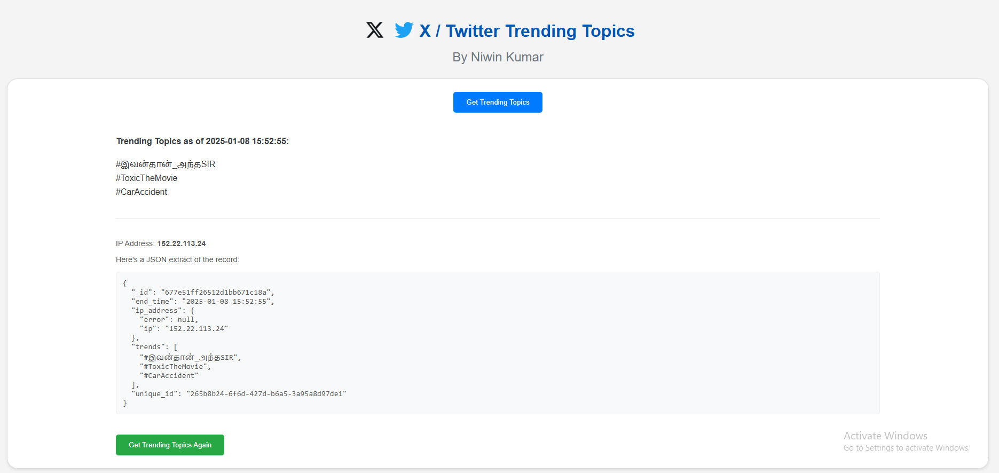

# X / Twitter Trending Topics Web Application
Author: Niwin Kumar (2025)

This web application allows you to view the latest trending topics on Twitter (X) by using a Flask backend and a MongoDB database to store trending topics. The app uses Selenium for web scraping and Proxymesh for proxy rotation to fetch the trends.

#Screenshot 


## Features

- Fetch the latest trending topics on Twitter (X).
- Store trends data in MongoDB for later access.
- Use proxy rotation through Proxymesh to avoid scraping restrictions.
- Display the trending topics on a simple and user-friendly web interface.
- View detailed information about the latest trends in a JSON format.

## Technologies Used

- **Flask**: Python web framework for the backend.
- **Selenium**: Web scraping tool to fetch trending topics from Twitter.
- **MongoDB**: NoSQL database for storing trends data.
- **Proxymesh**: Proxy service for bypassing restrictions on web scraping.

## Setup Instructions

Follow the steps below to set up the project on your local machine.

### Prerequisites

- Python 3.7 or higher
- MongoDB (either local or cloud-based via MongoDB Atlas)
- Proxymesh account (for proxy access)

### Step 1: Clone the Repository

Clone the repository to your local machine:

```bash
git clone https://github.com/yourusername/trending-topics-app.git
cd trending-topics-app
```

### Step 2: Create a Virtual Environment

It's recommended to create a virtual environment for the project to manage dependencies:

```bash
python -m venv venv
source venv/bin/activate  # On Windows, use `venv\Scriptsctivate`
```

### Step 3: Install Dependencies

Install the required dependencies listed in `requirements.txt`:

```bash
pip install -r requirements.txt
```

### Step 4: MongoDB Setup Guide

## Using MongoDB Compass
1. **Start MongoDB Server**: Ensure MongoDB is running on your system.
2. **Connect with Compass**: Open Compass and connect using the default URI: `mongodb://localhost:27017`.
3. **Create Database & Collection**:
   - In Compass, create a database (e.g., `trending_topics`) and a collection (e.g., `trends`).
4. **Update Connection in Project**:
   - Update your `config.py`:
     ```python
     MONGO_URI = "mongodb://localhost:27017/"
     MONGO_DB = "twitter_data"
     MONGO_COLLECTION = "trending_topics"
     ```

## Using MongoDB Atlas
1. **Create a Cluster**: Sign up at [MongoDB Atlas](https://www.mongodb.com/cloud/atlas) and set up a free-tier cluster.
2. **Get Connection String**:
   - Click **Connect** → **Connect your application** → Copy URI.
3. **Update Connection in Project**:
   - Replace `<username>`, `<password>`, and `<dbname>` in `config.py`:
     ```python
     MONGO_URI = "mongodb+srv://<username>:<password>@cluster.mongodb.net/<dbname>"
     MONGO_DB = "twitter_data"
     MONGO_COLLECTION = "trending_topics"
     ```

Choose the method based on your preference!


### Step 5: Set Up Proxymesh

1. **Sign Up for Proxymesh**:
   - Go to [Proxymesh](https://proxymesh.com/) and sign up for an account.
   - After signing up, you will receive your **Proxymesh username** and **password**.

2. **Update Proxy Credentials**:
   - Open the `config.py` file and find the section where proxy credentials are used.
   - Replace with your Proxymesh username and password.
    ```bash
    PROXY_LIST = ["http://<username>:<password>@open.proxymesh.com:PORT"]
    ```

### Step 6: Run the Application


To start the Flask app, run:

```bash
python app.py
```

This will start the server, and the web app should be accessible at `http://127.0.0.1:5000`.

### Step 7: Access the Trending Topics

- Go to `http://127.0.0.1:5000` in your browser.
- Click on **Get Trending Topics** to fetch the latest trends from Twitter (X).
- You will see the trending topics displayed on the page along with additional information in JSON format.

## File Structure

```
trending-topics-app/
├── app.py                  # Main Flask application file
├── config.py               # All Variables and Credentials are stored here
├── database.py             # Reading and Writing on MongoDB
├── main.py                 # Main Flask application file
├── twitter_scraper.py      # Selenium Scraping code for Twitter
├── requirements.txt        # Dependencies for the project
├── templates/
│   └── index.html          # HTML template for displaying trends
└── README.md               # Project documentation
```

## Troubleshooting

1. **Error: Proxy Authentication Failed**:
   - Ensure that your Proxymesh username and password are correct in the `config.py` file.

2. **Error: MongoDB Connection Failed**:
   - Double-check the MongoDB URI and credentials in the `config.py` file.
   - Ensure that your MongoDB Atlas cluster allows connections from your IP address.

3. **Selenium Issues**:
   - If you encounter issues with Selenium or the webdriver, try updating the WebDriver Manager or the browser driver.

## License

This project is open source and available under the [MIT License](LICENSE).

## Author

By [Niwin Kumar](https://github.com/yourusername)

---

Feel free to contribute or report issues in the repository!
